# CraftyFunge

CraftyFunge is a 3-dimensional esoteric programming language written by placing Minecraft blocks. It requires 1.19 Java Edition. Programs can be run directly in Minecraft or with the external interpreter. The external interpreter accepts programs exported from structure blocks. CraftyFunge is executable in vanilla Minecraft using the provided world with an embedded data pack.

### The Instruction Pointer

Much like other fungeoids, the Instruction Pointer (IP) has no fixed direction, and can be redirected in any of 6 possible ways. Each block is treated as one instruction. There is no wraparound, and when executed in Minecraft the IP will continue on until it reaches an unloaded chunk. When executed with the external interpreter it will raise an exception.

### Storage

For storage, CraftyFunge uses both a stack and variables. Commands read and write to the stack, but for convenience there are commands to read and write to variables. Additionally, as a way of storing data or modifying its own code, CraftyFunge can get and set blocks.

### Minecraft Limits

When run in Minecraft, the stack has a maximum length of 128, and there are 128 possible variables from indices 0-127. Further pushes to the stack will overwrite earlier values, and attempting to access indices outside of the allowed range will truncate to the nearest value in range. Each cell is a 32-bit integer with a minimum value of -2,147,483,648 and a maximum value of 2,147,483,647. Attempting to go past these limits will result in wraparound. These limits are removed for the external interpreter.

### Take Note

When programming in Minecraft, beware of redstone interactions. Observers can activate pistons placed next to them, and the button used to activate the starting command block can do so as well.

### [Hello World Program Video](https://imgur.com/vwolel7)

## Instructions

| Instruction                 | Image                                                        | Block Name                | Description                                                  |
| --------------------------- | ------------------------------------------------------------ | ------------------------- | ------------------------------------------------------------ |
| Start                       |      | Command Block             | Start the program, setting the IP to the direction the command block is pointing. |
| End                         |                  | Bedrock                   | End the program.                                             |
| Change Direction            | 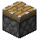                   | Piston                    | Set the IP direction to wherever the piston's head is pointing. |
| Random Direction            |  | Magenta Glazed Terracotta | Set a random IP direction.                                   |
| Skip                        |          | Sea Lantern               | Jump over the next block.                                    |
| Conditional Skip            |      | Redstone Lamp             | Pop one value off the stack and jump over the next block if zero. |
| Push 0-9                    |    | Concrete                  | Pushes 0-9 to the stack, depending on the block's color.     |
| Push 10-90                  |    | Terracotta                | Pushes 10-90 to the stack, depending on the block's color.   |
| Push 100-900                |          | Wool                      | Pushes 100-900 to the stack, depending on the block's color. |
| Push 1,000-9,000            |  | Stained Glass             | Pushes 1000-9000 to the stack, depending on the block's color. |
| Push 1,000,000 to 9,000,000 |  | Shulker Box               | Pushes 1,000,000-9,000,000 to the stack, depending on the block's color. |
| Add                         |            | Iron Block                | Pop a, b. Push b + a.                                        |
| Subtract                    |            | Gold Block                | Pop a, b. Push b - a.                                        |
| Multiply                    |      | Diamond Block             | Pop a, b. Push b * a.                                        |
| Integer Divide              |      | Emerald Block             | Pop a, b. Push b / a. Uses integer division.                 |
| Modulus                     | 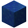         | Lapis Lazuli Block        | Pop a, b. Push b % a.                                        |
| Exponent                    | 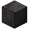 | Netherite Block           | Pop a, b. Push b^a. Negative exponents will truncate the result to 0. |
| Negate                      |            | Coal Block                | Negates the top of the stack.                                |
| Not                         | 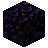               | Obsidian                  | Pop a. Push 1 if a is 0, else push 0.                        |
| Greater Than                | 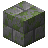 | Mossy Stone Bricks        | Pop a, b. Push 1 if b > a, else push 0.                      |
| Less Than                   | 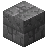 | Cracked Stone Bricks      | Pop a, b. Push 1 if b < a, else push 0.                      |
| If                          | 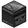               | Observer                  | Pop one value off the stack. If it is 0, change the IP direction to the back of the block, else change the IP direction to the front. |
| Duplicate                   |    | Crafting Table            | Duplicate the top value of the stack.                        |
| Pop                         |          | Magma Block               | Discard the top value of the stack.                          |
| Clear                       | 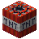                         | TNT                       | Reset the stack to empty.                                    |
| Swap                        |                  | Pumpkin                   | Swap the top two elements of the stack.                      |
| Rotate                      |                      | Melon                     | Pop a. Rotate the top \|a\|+1 elements of the stack. If a is positive, make the bottom element on the top. If a is negative, make the top element on the bottom. |
| Push Length                 | 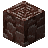   | Ancient Debris            | Push the length of the stack onto the stack. Trailing zero values aren't counted towards the length. |
| Numeric Output              |              | Dispenser                 | Pop and print the top of the stack as a number, followed by a space. |
| Text Output                 | 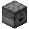                 | Dropper                   | Pop and print the top of the stack as an ASCII character.    |
| Newline Output              |              | Bookshelf                 | Prints a newline.                                            |
| Raise Error                 | 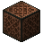           | Note Block                | Raises an error and halts the program.                       |
| Numeric Input               | 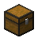                     | Chest                     | Input a number and push to the stack. Pushes -1 upon EOF or invalid input. |
| Text Input                  | 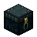         | Ender chest               | Input one character and push its ASCII value to the stack. Pushes -1 upon EOF. |
| Push Next Block Value       | 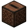                 | Jukebox                   | Read the next block's value in the direction of the IP, push it to the stack, then skip over that block. If the value is invalid, does nothing. |
| Get Block                   | 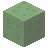         | Slime block               | Pop z, y, x. Get the block's value at (x, y, z) and push it onto the stack. If the value is invalid, does nothing. |
| Set Block                   | 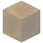         | Honey block               | Pop z, y, x, B. Set the block at (x, y, z) to the block corresponding to the value of B. If the value is invalid, does nothing. |
| Get Variable                |  | Red Nether Bricks         | Pop i. Push the value of the variable at index i.            |
| Set Variable                | 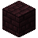     | Nether Bricks             | Pop i, v. Set the value of the variable at index i to value v. |
| Push Current Position       | 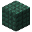 | Dark Prismarine           | Push the IP's current coordinates x, y, z to the stack.      |
| Goto                        | 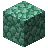           | Prismarine                | Pop z, y, x. Teleport the IP to (x, y, z), retaining the same direction. |
| Tunnel                      | 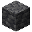             | Deepslate                 | Enter/exit tunneling mode.                                   |
| Input Number Literal        |                      | Glass                     | Enter/exit number literal input mode.                        |
| Input Text Literal          |        | Tinted Glass              | Enter/exit text literal input mode.                          |

All coordinates are relative to the starting command block, although it is recommended to place the starting block at (0, 0, 0) so the coordinates line up.

### Pushing Numbers

Numbers can be pushed to the stack using concrete, terracotta, wool, stained glass, or shulker boxes. The value depends on the color and block type. Colors are as follows:

| Color      | Digit |
| ---------- | ----- |
| Red        | 1     |
| Orange     | 2     |
| Yellow     | 3     |
| Lime       | 4     |
| Green      | 5     |
| Light Blue | 6     |
| Cyan       | 7     |
| Blue       | 8     |
| Purple     | 9     |

Multipliers are as follows:

| Block         | Multiplier |
| ------------- | ---------- |
| Concrete      | 1          |
| Terracotta    | 10         |
| Wool          | 100        |
| Stained Glass | 1,000      |
| Shulker Box   | 1,000,000  |

The value pushed is the product of the digit and the multiplier. For example, green concrete would push 5, and cyan wool would push 700.

To push 0 to the stack, use white concrete.

### Block Values

*Get block*, *set block*, and *input text literal* assign a numeric value to each block. Concrete/terracotta/wool/stained glass/shulker box blocks that can be used to push numbers all have the same block values as their literal forms. An exception to this is air, which has a block value of 0 instead of white concrete, which has the special value of -2,147,483,648. Other blocks are used to fill in the gaps.

For a full list of block values, see [`block_values.md`](./doc/block_values.md)

## Execution Modes

### Default

While in default mode, the IP will execute instructions according to the instruction table. The IP starts in default mode.

### Tunneling

While in tunneling mode, the IP will continue in the same direction until it reaches another deepslate block, ignoring any other instructions.

### Numeric Literal Input

While in numeric literal input mode, the IP will read a number digit-by-digit and push that to the stack. White concrete counts as 0, and colored blocks of concrete/terracotta/wool/stained glass/shulker box (it doesn't matter the block type) correspond to the other digits 1-9. A coal block will negate the result, and additional coal blocks have no effect. The IP will ignore all other instructions except for direction changes from pistons and will exit when it reaches another glass block. If the IP doesn't read any valid blocks while in this mode, it will push 0.

### Text Literal Input

While in text literal input mode, the IP will push the block value of each block it encounters to the stack until it reaches another tinted glass block. This is analogous to Befunge's string mode. One limitation is that tinted glass blocks (having block value INT32_MAX = 2,147,483,647) cannot be read through text literal input. They can still be read through *get block* or *push next block value*.

## Input in Minecraft

Input is written in the book and quill *Input* and is placed in the chest marked *Input* before running a program. Programs are limited to one page of input.

## Stack Pre-Population

CraftyFunge supports pre-populating the stack. For the external interpreter, this is achieved with the command-line option `-s`. In Minecraft, edit the book in the "Stack Pre-Population" chest. Values are read into the stack from left to right, so the rightmost value is the top of the stack.

## Execution Delay in Minecraft

The default execution speed in Minecraft is one instruction per 3 ticks, or 0.15 seconds. The scoreboard player and objective `$ip delay` controls this if you want to speed up or slow down the execution rate. To go even faster than one instruction per tick I recommend the mod [Carpet](https://www.curseforge.com/minecraft/mc-mods/carpet) and the command `/tick rate`. Be aware that high speeds cause the IP's position to start to smear as it can't keep up with the teleportations, however this is purely cosmetic.

## How to Run

### In Minecraft

1. Write a program by placing blocks
2. Activate a command block containing the command `craftyfunge:start`. The IP will start from that block and execute the program.
   * To run a program stepwise for debugging, replace the command with `craftyfunge:start_step`. To run a step, run the command `craftyfunge:run_step`

### From a File

#### Command Syntax

`craftyfunge [-h] [--version] [-w] [-d] [-l [DEBUGFILE]] [-s STACK] [-i INFILE] [-o OUTFILE] FILE`

#### Description

Runs the program `FILE`, where `FILE` is an nbt file exported from a structure block.

| Flag             | Description                                                  |
| ---------------- | ------------------------------------------------------------ |
| `-h`, `--help`   | Print a help message.                                        |
| `--version`      | Display the version.                                         |
| `-w`             | Run a file from the structure block export location `<WORLD>/generated/craftyfunge/structures/`, where `<WORLD>` is the world save location loaded from `world.cfg`. Fails if no world location has been specified. |
| `-d`             | Run the program in debug mode, printing the position, block, and stack at each step. |
| `-l [DEBUGFILE]` | Log the debug output separately. Defaults to `debugout.txt`. Has no effect if `-d` is not called. |
| `-s STACK`       | Pre-populate the stack with the values in `STACK`, which must be formatted as a comma-separated list of integers surrounded by square brackets with no spaces. Ex. [1,2,3,4,5] |
| `-i INFILE`      | Take input from `INFILE` instead of stdin.                   |
| `-o OUTFILE`     | Send output to `OUTFILE` instead of stdout.                  |

#### Notes For Exporting From Minecraft

You can export a program from Minecraft using a structure block and save it to `craftyfunge:<program>`. This will generate an NBT file at `<WORLD>/generated/craftyfunge/structures/<program>.nbt`, where `<WORLD>` is the world save folder. To execute, you can either specify the full path to the program or you can configure your world save location in `world.cfg` and use the `-w` option.

## Recommended Helper Mods

While it is entirely possible to program in CraftyFunge without the use of mods, they do bring quality of life improvements. I recommend the following:

* [Carpet](https://www.curseforge.com/minecraft/mc-mods/carpet) for increasing execution speed
* [WorldEdit](https://www.curseforge.com/minecraft/mc-mods/worldedit) for copying and pasting code

## Building

You need the following dependencies:

* [NBT](https://pypi.org/project/NBT/)
* [PyInstaller](https://pyinstaller.org/en/stable/)

After that, go to `src/craftyfunge.spec` and edit the variable `startPath` to the absolute path of wherever `src` is on your computer.

Then, run `build.bat` and let PyInstaller do its thing.

## Credits

Made by Eli Fox

String Parser library datapack by Suso, with help from McTsts and Gibbsly
